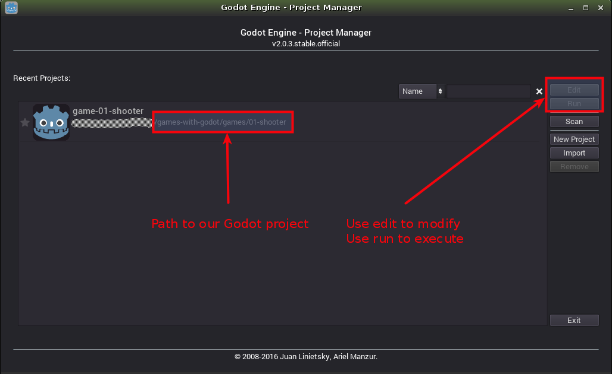
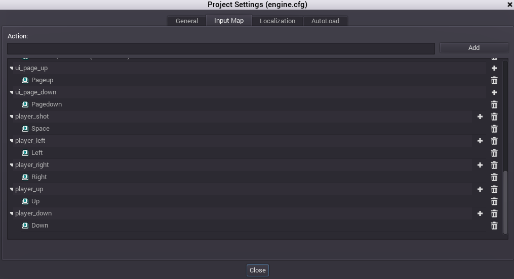
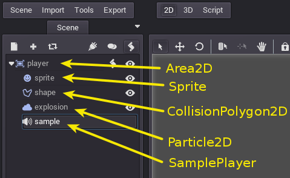

#Proyecto 01-shooter

Empezamos nuestros tutoriales con un shooter 2D, porque parece un juego sencillo para empezar.

#Créditos

* Basado en un idea original de Juan Linietsky:
    * [Proyecto Github](https://github.com/reduz/godot_workshop)
    * [Vídeo de Youtube en español](https://www.youtube.com/watch?v=XEkePR_3BU8) 
    * [English Youtube video](https://www.youtube.com/watch?v=9GPIeeJXBLc)   

Otros enlaces de interés
* [starwars](https://github.com/TutorialDoctor/TD-Godot-Games/tree/master/starwars)

Esquema de trabajo:
1. Idea
2. Assets
3. Crear personajes
4. Lo unimos todos
5. Volver al paso 1

#1. La idea

Vamos a crear un minijuego de marcianitos 2D.

* Creamos directorio para el proyecto llamado `01-shooter`.
* Creamos un nuevo proyecto Godot `Programa Godot -> New Project`.
* Editamos el proyecto para comenzar a crear el juego.

#2. Assets

Descargamos unos `assets` para empezar:
* Los gráficos los descargamos de `https://github/reduz/godot_workshop`.
* Los sonidos se han descargado de [FreeSound](https://www.freesound.org)
   * Convertimos el fichero en formato WAV de 16 bits.
* Los iconos se han descargado de [www.game-icons.net](www.game-icons.net)

#3. Creando los personajes

#Player character

Vamos a crear el personaje del jugador.

* Creamos las **aciones**(InputMaps) en `Scene -> Project Settings -> InputMaps`
    * Las acciones de nuestro `player` en el juego serán: `left`, `right`, `up`, `down` and `shot`.
    * Asociamos entradas con nombres de acciones que vamos a usar en nuestro juego.

* Creamos una **escena** para contener a `player` con la siguiente estructura de nodos.

* Como nodo principal/raíz un `Area2D`.
* Dentro un nodo `Sprite` para la imagen.
    * En el atributo textura pondremos la imagen
* Explosión (`/explosion`)
    * Dentro de player añadir nodo `Particle2D`.
    * Texture poner la imagen.
    * Spread 180
    * Linear velocity 100
    * Lifetime 1
    * Explosiven 0.2
    * Timeout 0.5
* Colisiones (`shape`)
    * Añadimos un nodo `CollisionPolygon2D`
    * Creamos una forma poligonal de colisión.
    * Guardamos la escena `player`.
* Sonido (`sample`)
    * Guardamos el fichero de sonido en la carpeta `player` del proyecto.
    * Añadimos nodo `SamplePlayer` y lo llamamos `sample`
    * Vamos a `Config -> Sample -> New SampleLibrary`
    * Añadimos en audio conel nombre `explosion`.
    * Incorporamos código en GDScript para activar (play) el sonido cuando
    explote el jugador.
* Para darle un comportamiento a `player`, creamos un **script** en el nodo raíz.
    * Este script nos permitirá controlar la nave.
    * Consultar script [player.gd](./../../games/01-shooter/player/player.gd).

#Enemy character

* Creamos una nueva **escena** para `enemy`.
* Creamos un nodo raíz del tipo `Area2D`.
* Añadimos nodo `AnimatedSprite`
    * En `frames` añadimos las imágenes que forman parte de la animación.
* Añadimos nodo `AnimationPlayer`
    * Nueva
    * Lápiz -> Keys
    * activar Autoplay
* Añadimos un nodo `CollisionShape2D`
    * Shape de tipo circle2D.
* Señales: Crear señal desde `Area2D`
    * Enemy area -> Script

#Level

Creamos un nivel para usar los personajes creados anteriormente.

* Creamos una escena nueva `Node2D` llamada `level1`.
* Instanciamos los objetos que hemos creado: `player` y `enemy`.
* Los enemigos se pueden instanciar/copiar muchas veces para tener más.
* Creamos un `Node2D` llamado `enemies` y ponemos como hijos de este ( acción `reparent`)
a todos los nodos `enemy`. Esto lo hacemos para poder manejar a todos los
enemigos como un ejército.
* Para animar a todo el ejército añadimos nodo `AnimationPlayer` llamada `move_enemies`.
    * Creamos animación llamada `move_down`.
    * Elegimos nodo `enemies` y añadimos un nuevo key en pos=0.
    * Ponemos de tiempo 10 segundos para la animación.
    * En el segundo 10, movemos el ejército y creamos un segundo key final.

#Disparo

Vamos a crear una nueva escena para que sea el disparo del player.
* Creamos nueva escena con nodo base `Area2D` y lo llamaremos shot.
* Añadimos `sprite`.
* Añadimos `CollisionPoligon2D`.
* Le creamos un script al `shot` para que cambie la posición.
* Añadimos nodo `VisibilityNotifier2D`
    * Lo conectamos a  `exit_screen` del script de `shot`.
    * En el código liberamos el recurso (`queue_free`).
* En el enemigo al recibir un disparo debe desaparecer. Ver el código.
* Creamos acción de disparar en `project settings -> InputMaps`.

#TODO

* Poner sonido en las explosiones, y en los disparos.
* Hacer que los marcianos exploten.
* Sumar puntos con cada marciano muerto.
* Cerrar la ventana del juego al terminar.
